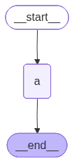
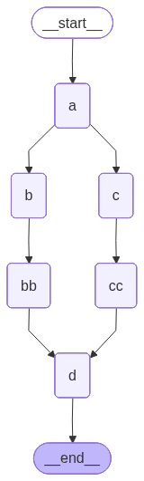
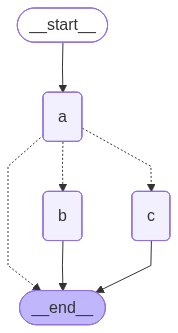
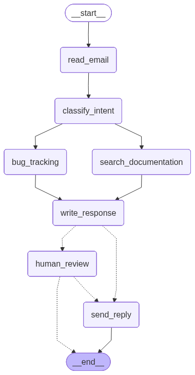

# 🦜🔗 LangGraph Essentials Course - Portfolio

Welcome to my comprehensive portfolio documenting my journey through the **LangGraph Essentials Course**. This repository contains production-ready Python implementations of all course labs, converted from original Jupyter Notebooks into clean, modular Python scripts (`.py`), utilizing **Google Gemini** and **OpenAI** via LangChain.

---

## 🚀 Technical Highlights & Tech Stack
* **Framework:** LangGraph (StateGraph, Command Routing, Interrupts, InMemorySaver)
* **LLM Providers:** Google Gemini (`gemini-2.5-flash`) 
* **Validation & State:** Pydantic (Structured JSON), TypedDict, Reducers (`Annotated`, `operator.add`)
* **Environment:** Python 3.11+, `python-dotenv`, Virtual Environments (`venv`)

---

## 📚 Course Curriculum

| Lab | Topic | State Management | Flow Control | Memory |
| :--- | :--- | :--- | :--- | :--- |
| **Lab 01** | States & Nodes Foundations | Overwrite | Linear | ❌ |
| **Lab 02** | Parallel Execution (Fan-out/In) | Append (`operator.add`) | Parallel | ❌ |
| **Lab 03a**| Conditional Routing | Append | Conditional Edges | ❌ |
| **Lab 03b**| Dynamic Routing via Command | Append | Command Routing | ❌ |
| **Lab 04** | Chatbot Session Memory | Append | Dynamic Routing | ✅ InMemorySaver |
| **Lab 05** | Human-In-The-Loop (HITL) | Append | Interrupt & Resume | ✅ InMemorySaver |
| **Lab 06** | Enterprise Email Agent | Custom State | Multi-path + HITL | ✅ Multi-thread |

---

## 🛠️ Lab Breakdown & Architecture Visualizations

### 📁 Lab 01 — States & Nodes Foundations
* **Core Takeaway:** LangGraph applications revolve around a localized shared `TypedDict` state. Every node is a pure function that receives the state, performs computations, and returns only the mutated keys.
* **State Behavior:** By default, returning an existing key completely **overwrites** the previous value.

<p align="center">
  
</p>

---

### 📁 Lab 02 — Parallel Execution & Reducers
* **Core Takeaway:** Introduced **Reducers** via `Annotated[list[str], operator.add]` which forces the graph to *append* items to lists instead of overwriting them.
* **Parallel Execution:** Enables Fan-Out/Fan-In architectures. LangGraph automatically blocks and awaits all concurrent parallel branches to finish before pushing data to downstream nodes.

<p align="center">
  
</p>

---

### 📁 Lab 03a — Conditional Routing
* **Core Takeaway:** Implements routing logic using `add_conditional_edges()`. This pattern keeps business logic inside the nodes strictly separated from the routing governance functions.

<p align="center">
  
</p>

---

### 📁 Lab 03b — Dynamic Routing with Command
* **Core Takeaway:** Combines state updates, business logic, and routing decisions into a single atomic operation inside the node itself by returning a `Command(update=..., goto=...)` object.

<p align="center">
  
</p>

---

### 📁 Lab 04 & 05 — Memory & Human-In-The-Loop (HITL)
* **Lab 04 (Memory):** Compiling graphs with `InMemorySaver()` checkpointers allows state persistence across distinct execution cycles matching a specific `thread_id`.
* **Lab 05 (HITL):** Uses `interrupt()` to pause graph states securely, awaiting a human signal `Command(resume=...)` to resume processing from the exact injection point.

<p align="center">
  
</p>

---

### 📁 Lab 06 — Enterprise Email Agent (Capstone Project)
* **Core Takeaway:** An end-to-end multi-path business agent. It takes raw emails, extracts structured data using Pydantic, triggers parallel context lookup tracks (Database lookup + Bug ticketing), drafts replies, and safely flags high-urgency or complex topics for human review before execution.

<p align="center">
  
</p>

---

## 📂 Project Directory Structure
```text
langgraph-essentials-course/
│
├── Lab01_States.py
├── Lab02_Parallel.py
├── Lab03a_Conditional.py
├── Lab03b_Command.py
├── Lab04_Memory.py
├── Lab05_HITL.py
├── Lab06_Email_Agent.py
│
├── output/
│   ├── graph_viz_lab01.png
│   ├── graph_viz_lab02.png
│   ├── graph_viz_lab03a.png
│   ├── graph_viz_lab03b.png
│   ├── graph_viz_lab05.png
│   └── graph_viz_lab06.png
│
├── requirements.txt
├── .env
└── README.md

```

---

## ⚙️ Quickstart: Local Installation & Setup

Follow these step-by-step instructions to clone, configure, and execute this project locally on your machine.

### 1. Clone the Repository

```bash
git clone [https://github.com/YOUR_USERNAME/langgraph-essentials-course.git](https://github.com/YOUR_USERNAME/langgraph-essentials-course.git)
cd langgraph-essentials-course

```

### 2. Configure Environment and Virtual Environment

Create a clean python virtual environment to safely isolate dependent libraries:

```bash
# Create Environment
python -m venv venv

# Activate Environment (Windows)
.\venv\Scripts\activate

# Activate Environment (Mac / Linux)
source venv/bin/activate

```

### 3. Install Package Dependencies

Install all required LangGraph, LangChain, and validation packages mapped inside the configuration manifest:

```bash
pip install -r requirements.txt

```

### 4. Setup Secret API Keys

Create a new file named exactly `.env` in the root directory of the project, and add your API credentials:

```text
GOOGLE_API_KEY=AIzaSyYourActualGeminiStudioKeyHere

```

*Note: Make sure `.env` is listed inside your `.gitignore` file to ensure security credentials are never pushed upstream.*

### 5. Running the Application Modules

You can run and test any isolated lab execution script directly from your terminal:

```bash
python Lab01_States.py
python Lab02_Parallel.py
python Lab03a_Conditional.py
python Lab03b_Command.py
python Lab04_Memory.py
python Lab05_HITL.py
python Lab06_Email_Agent.py

```
